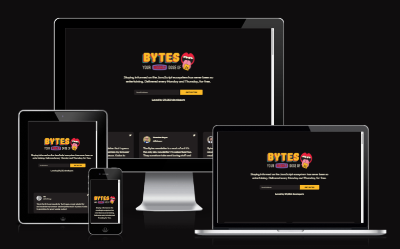
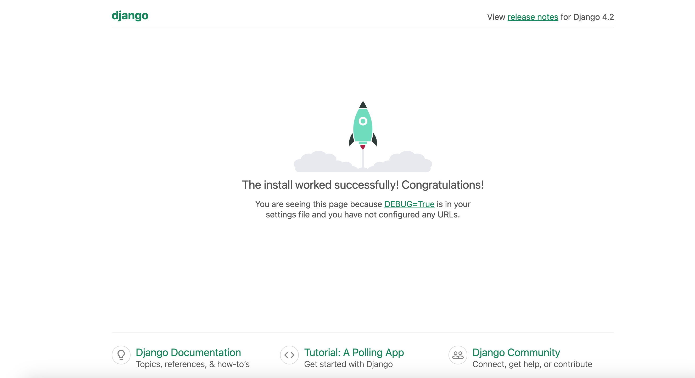

# The Blue Box Exchange

## *** UNDER CONSTRUCTION ***

This is my final project for my Full-stack Level 5 Diploma. It is a Django based full e-commerce solution allowing users 4 tiers of access; basic, plus, pro and admin.

Bootstrap5.3, jQuery3.7.1 plus custom code from myself powers a site dedicated to allowing users to buy and sell Dr. WHo related merchandise. Running on the Heroku platform with ElephantSQL managing the database this site has a clean modern uncluttered look and with its message board feature encourages Dr. Who fans to exchange info about the show they love whilst adding to their Dr. Who collection. Plus a gallery allowing fans of the show to upload their own fan art.

## Table of Contents

1. [Initial Setup of IDE and Github](#initial-setup-of-ide-and-github)
2. [Problems, Bugs and Fixes](#problems-bugs-and-fixes)

## Initial Setup of IDE and Github

To create a new repo:

first go to https://github.com/ and create a new repo, then in the terminal:

- echo "# test" >> README.md
- git init
- git add README.md
- git commit -m "first commit"
- git branch -M main
- git remote add origin https://github.com/thespamster/the_blue_box.git
- git push -u origin main

In VS Code in the terminal create a virtual environment:

- python -m venv venv -- creates virtual environment

- venv\Scripts\Activate.ps1 -- activates virtual environment

Add a  .gitignore file and MIT LICENSE, then create an assets folder and subfolders for CSS, Javascript and images with a separate subfolder for the README images.

With the virtual environment activated the Django project is created by first installing Django

- pip3 install django

Start the new project

- django-admin startproject blue_box

Test launch in Chrome from 127.0.0.1:8000

Run initial migrations

- python manage.py migrate

Create an Admin (superuser)

- python manage.py createsuperuser

Add username, email address and password

Install django-allauth for user authentication

- pip3 install django-allauth

Copy default allauth templates into custom templates folder for styling

- cp -r < Filepath to allauth templates >* ./templates/allauth

[Back to top](#the-blue-box-exchange)

## Testing

### Manual Testing

1. Test 1: to check that allauth is working using email verification

In 'settings.py' EMAIL_BACKEND = 'django.core.mail.backends.console.EmailBackend'

   - Expected   - that email verification would be asked for on 'admin' account
   - Testing    - went to accounts/login and entered 'admin' login details
   - Result     - email verification requested by allauth
   - Fix        - TEST PASSED no fix required

## Problems Bugs and Fixes

### Inconsistent Migrations Error:

On initial migrations the sites app was not added to the INSTALLED APPS in settings.py creating an 'inconsistent migration' error when added in later as it must be included in the first migrate.
This prevents any further migrations from happening. The solution is on a  Stackoverflow thread here:

- [Stackoverflow](https://stackoverflow.com/questions/42150499/how-do-i-delete-db-sqlite3-in-django-1-9-to-start-from-scratch) - credit to Mohammed Shareef C. for his solution. 
    - delete the 'db.sqlite3' file
    - rm * /migrations/0 *.py (1 space after rm but remove the other 2 spaces)
    - python manage.py makemigrations
    - python manage.py migrate

## Acknowledgements

- [Stan Triepels](https://djangowaves.com/tips-tricks/gitignore-for-a-django-project/) - for the excellent vscode django gitignore file.
- [reMarkable 2](https://remarkable.com/) - e-ink tablet used to generate wireframes as PDF.
- [Smashicons on Flaticon](https://www.flaticon.com/free-icons/tardis) - Tardis icons created by Smashicons. Check them out. Awesome icons for free.