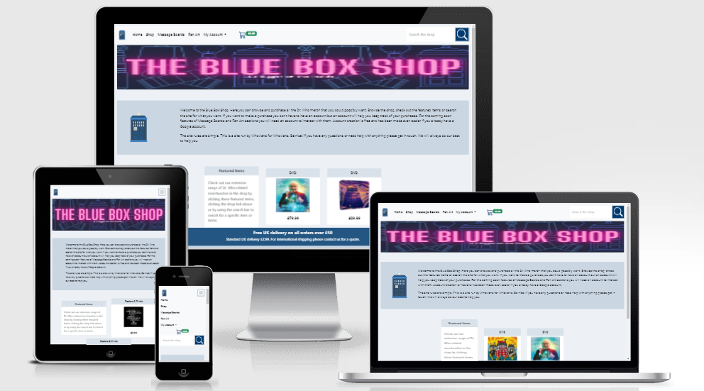
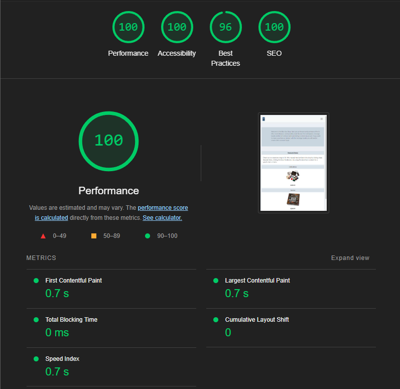
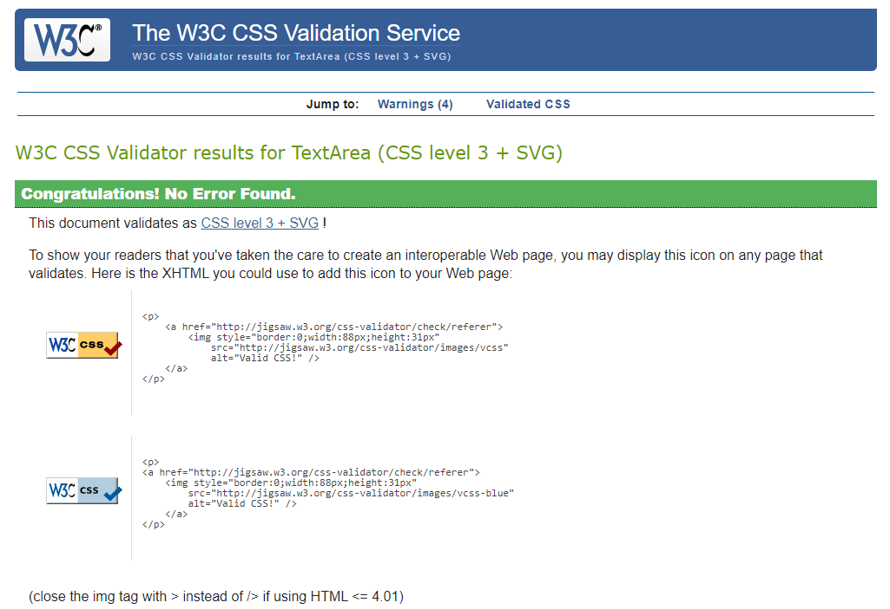
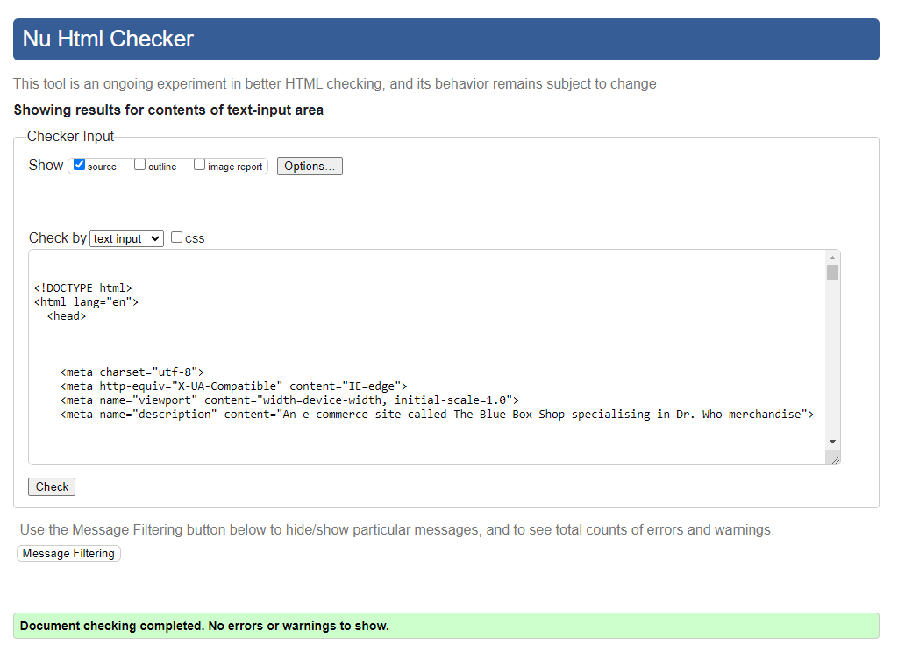

# The Blue Box Shop

## *** UNDER CONSTRUCTION ***

This is my final project for my Full-stack Level 5 Diploma. It is a Django based full e-commerce solution allowing users to browse the shop without creating an account or the option to purchase when an account is created.

Bootstrap5.3, jQuery3.7.1 plus custom code from myself powers a site dedicated to allowing users to buy Dr. WHo related merchandise. Running on the Heroku platform with ElephantSQL managing the database this site has a clean modern uncluttered look with a sophisticated search ability meaning that a user can quickly find the items that interest them the most.

## Table of Contents

1. [Initial Setup of IDE and Github](#initial-setup-of-ide-and-github)
2. [Problems, Bugs and Fixes](#problems-bugs-and-fixes)
3. [User Stories](#user-stories)
4. [Creator Stories](#)
5. [Social Account Login](#social-account-logins)

## User Stories

There are are two main user stories. Firstly the site admin's story and secondly a visitor to the site's story. 

### The Admin Story

- The site admin needs full CRUD access to the site. This means...
- an ability to create new database entries for the site
- an ability to access current database entries
- they can edit existing database entries either to correct an error or add new information
- they also have an option to delete database entries

### The user story

This is broken down into two subsections...

- The casual visitor who does not want to create an account
- The buyer that wants more interaction with the site and creates an account to enable this

### The casual visitor

- Should have access to the shop and all the listings therein
- Should be able to use the search option to narrow down the products that are on screen
- Should have the option to create an account if they decide on more detailed interactions

### The buyer

Must be able to do everything that the casual visitor can do plus:

- Create and maintain a profile that enables a login so that the user can access the site features easily and with a minimum of fuss
- 

## Social Account Logins

To enable a simpler signup process a Google login option has been added to the login screen meaning that if a user has an existing Google account they can use this to create a profile for the shop.
As most phones are either Android or iOS most people will have already created either a Google account or Apple ID plus many more use Google services such as email and therefore also have an account. See 'acknowledgements' for a link to the video from Tech with Tim which was a great help in getting this to work.

## Initial Setup of IDE and Github

To create a new repo:

first go to https://github.com/ and create a new repo, then in the terminal:

- echo "# test" >> README.md
- git init
- git add README.md
- git commit -m "first commit"
- git branch -M main
- git remote add origin https://github.com/thespamster/the_blue_box.git
- git push -u origin main

In VS Code in the terminal create a virtual environment:

- python -m venv venv -- creates virtual environment

- venv\Scripts\Activate.ps1 -- activates virtual environment

Add a  .gitignore file and MIT LICENSE, then create an assets folder and subfolders for CSS, Javascript and images with a separate subfolder for the README images.

With the virtual environment activated the Django project is created by first installing Django

- pip3 install django

Start the new project

- django-admin startproject blue_box

Test launch in Chrome from 127.0.0.1:8000

Run initial migrations

- python manage.py migrate

Create an Admin (superuser)

- python manage.py createsuperuser

Add username, email address and password

Install django-allauth for user authentication

- pip3 install django-allauth

Copy default allauth templates into custom templates folder for styling

- pip3 show django-allauth to get location of default templates
- cp -r < Filepath to allauth templates >* ./templates/allauth

Creating individual apps for the project is done using the following line of code in the terminal

- python manage.py startapp < name_of_app >

[Back to top](#the-blue-box-exchange)

## Testing

### Manual Testing

#### Test 1: to check that allauth is working using email verification

In 'settings.py' EMAIL_BACKEND = 'django.core.mail.backends.console.EmailBackend'

- Expected   - That email verification would be asked for on 'admin' account
- Testing    - Went to accounts/login and entered 'admin' login details
- Result     - Email verification requested by allauth
- Fix        - No fix required. TEST PASSED

#### Test 2: Check that homepage loads correctly after creation of home app

In home app index.html added. text 'homepage link working' added to base.html. urls added for homepage.

- Expected      - That homepage would load with 'homepage link working' displayed onscreen
- Testing       - Started test server to load homepage 
- Result        - Index.html loaded with expected message
- Fix           - No fix required. TEST PASSED

#### Test 3: Check that all products page loads correctly after creation of products app

In products app products.html added. text 'all products link working' added to base.html. urls added for products page.

- Expected      - That all products page would load with 'all products page link working' displayed onscreen
- Testing       - Started test server to load homepage and navigated to products.html page
- Result        - Products page loaded with expected message
- Fix           - No fix required. TEST PASSED

#### Test 4: Check that individual product page loads correctly after creation of products app

In products app product_detail.html added. text 'product link working' added to base.html. urls added for product_detail page.

- Expected      - That  product page would load with 'product page link working' displayed onscreen
- Testing       - Started test server to load homepage, navigated to product_detail.html
- Result        - Product page loaded with expected message
- Fix           - No fix required. TEST PASSED

#### Test 5: to check that products are added successfully to the shopping cart

Added a temporary print cart function to cart views.py.

-  Expected  - That the output of the print function will show a dictionary consisting of product.id, quantity added
- Testing    - Started development server and selected an item. Then added item to cart
- Result     - Print output confirmed that item and quantity were added to the cart successfully
- Fix        - No fix required. TEST PASSED

#### Test 6: Google Lighthouse tests checking Performance, Accessibility, Best practices and SEO

These tests are run through Google's Dev Tools built into Chrome browser.

- Expected  - That the four areas tested return a green score ie 90 or above
- Testing   - Tests run by Google Lighthouse in Chrome Dev Tools
- Result    - Accessibilty required addition of some missing alt attributes and SEO required a meta description of the site in the header
- Fix       - Added missing alt attributes and a meta description and then reran the tests resulting in the scores shown in the image. TEST PASSED

#### Test 7: W3C CSS validator

- Expected  - That no errors would be reported when run through the validator
- Testing   - Tested by direct input of CSS code in style.css
- Result    - One error found with font-style used instead of font-family
- Fix       - Corrected the reported error and reran validation. No errors reported. TEST PASSED

#### Test 8: W3C HTML validator

- Expected  - That no errors would be reported when run through the validator
- Testing   - Tested by direct input of HTML code
- Result    - Two errors reported of button type rather than role. Trailing / errors with img and meta elements
- Fix       - Corrected the reported error and reran validation. No errors reported. TEST PASSED

#### Test 9: Google Login

- Expected  - That a user can use their Google account to create a profile on the Blue Box Shop
- Testing   - Used one of my Google accounts to create a profile
- Result    - Account created and checked via Admin panel. No errors during process
- Fix       - No fix required. TEST PASSED

#### Test 10: Custom CSS styling for allauth templates

- Expected  - That the allauth templates will be styled to better match the overall look and feel of the site
- Testing   - Started the development server and visited the login, signup, reset password, reset email and logout screens to check the styling
- Result    - Styling was present on all pages
- Fix       - No fix required. TEST PASSED

## Problems Bugs and Fixes

### Inconsistent Migrations Error:

On initial migrations the sites app was not added to the INSTALLED APPS in settings.py creating an 'inconsistent migration' error when added in later as it must be included in the first migrate.
This prevents any further migrations from happening. The solution is on a  Stackoverflow thread here:

- [Stackoverflow](https://stackoverflow.com/questions/42150499/how-do-i-delete-db-sqlite3-in-django-1-9-to-start-from-scratch) - credit to Mohammed Shareef C. for their solution. 
    - delete the 'db.sqlite3' file
    - rm * /migrations/0 *.py (1 space after rm but remove the other 2 spaces)
    - python manage.py makemigrations
    - python manage.py migrate

### Django could not locate the static files folder

When setting up static files for CSS and JS Django could not find the static folder. The solution was to add this to the settings.py file 

- [Stackoverflow](https://stackoverflow.com/questions/12809416/django-static-files-404) - credit to Amar Kamthe for their solution
- STATIC_ROOT = ''
- STATIC_URL = '/static/'
- STATICFILES_DIRS = ('static',)

### Creation of Product Models

When creating the product models Pillow image handling software for Python was not installed.

- python -m pip install Pillow
- version 10.3.0

### Footer moving up the screen when there is little to no content displayed

This is a very common issue when coding a website. What is needed is a footer that stays either at the bottom of the screen or bottom of the
content whichever is the lowest.

- [Stackoverflow](https://stackoverflow.com/questions/643879/css-to-make-html-page-footer-stay-at-bottom-of-the-page-with-a-minimum-height-b)- credit to vsync
    for a brilliantly simple solution.

### Fontawesome icons flicker on page render

There is a brief flicker from the Fontawesome icons as a page is rendered. The solution involved replacing these icons with Bootstrap SVG icons removing the flicker completely.

### Cannot change color of svg icons added using img tag

SVG icons have their color coded into the icon making it less straightforward to change their color as the css color attribute doesn't have any effect. The filter css attribute can change the color. For the explanation as to how see the Stackoverflow question linked below.

- [Stackoverflow](https://stackoverflow.com/questions/22252472/how-can-i-change-the-color-of-an-svg-element/53336754#53336754) - credit to Manish Menaria for a simple solution.

### System crashed with an error about expecting a str but received a tuple during admin add product

Error was traced to MEDIA_ROOT = (os.path.join(BASE_DIR, 'media')) having a trailing comma ie. MEDIA_ROOT = (os.path.join(BASE_DIR, 'media'),) which meant a tuple was expected but not received resulting in the error and app crash. Removing the trailing comma resolved the issue.

### No 'Back to all products' button on individual item page

Missing button was traced to the query variable not being passed back through base.html via context in product view.py. Once added the back button displayed correctly.

## Acknowledgements

- [Stan Triepels](https://djangowaves.com/tips-tricks/gitignore-for-a-django-project/) - for the excellent vscode django gitignore file
- [reMarkable 2](https://remarkable.com/) - e-ink tablet used to generate wireframes as PDF
- [Smashicons on Flaticon](https://www.flaticon.com/free-icons/tardis) - Tardis and under construction icons created by Smashicons. Check them out. Awesome icons for free
- [Bootstrap Icons](https://icons.getbootstrap.com/) - free svg icons from Bootstrap
- [Codepen](https://codepen.io/sosuke/pen/Pjoqqp) - hex to css filter convertor, allowing change of svg icons' color
- [Tech with Tim](https://www.youtube.com/watch?v=yO6PP0vEOMc) - setting up Django with a Google login option
- [Stackoverflow](https://stackoverflow.com/questions/62985371/how-do-i-target-label-for-with-jquery) - targeting specific labels in a form, thanks to kmoser for this helpful answer 